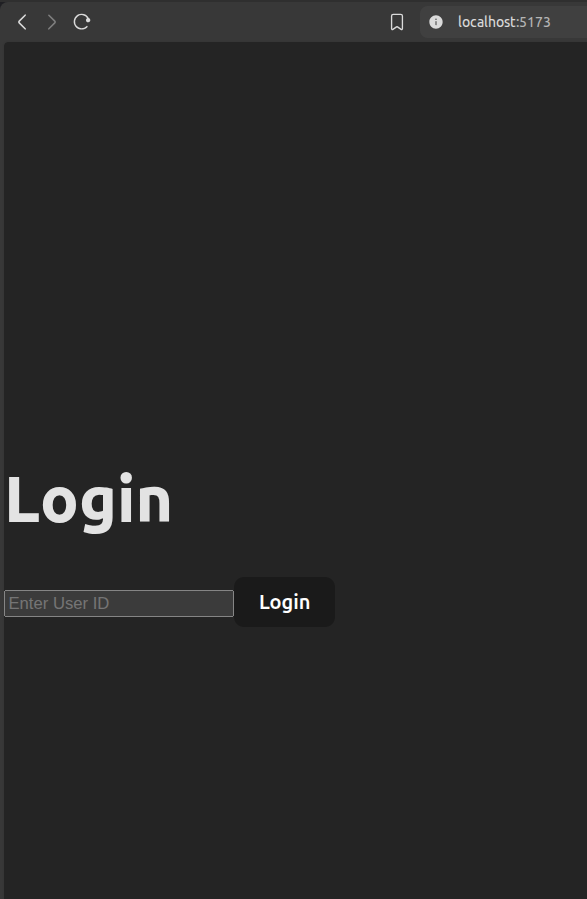
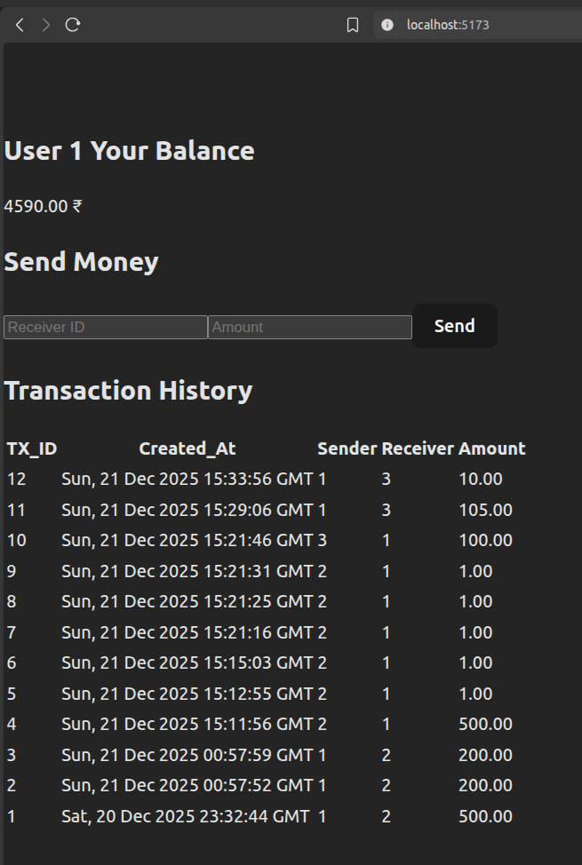
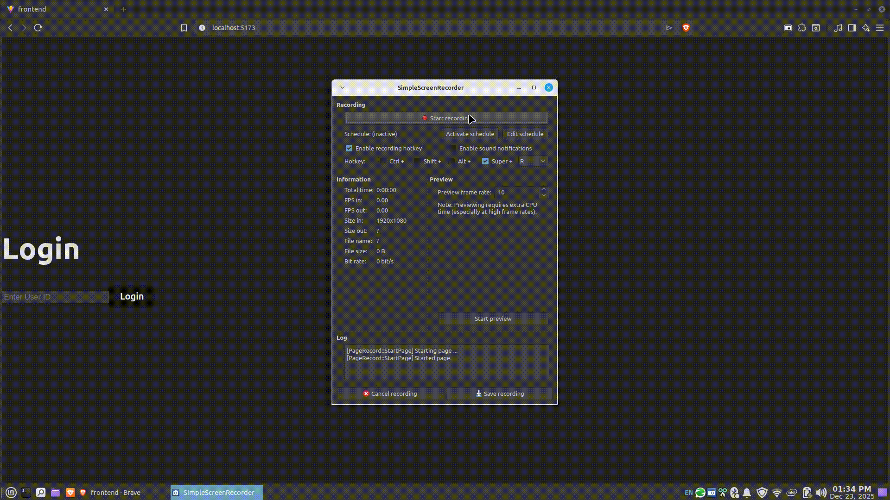
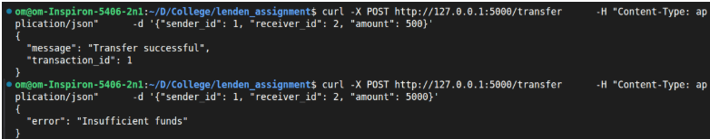
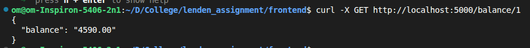
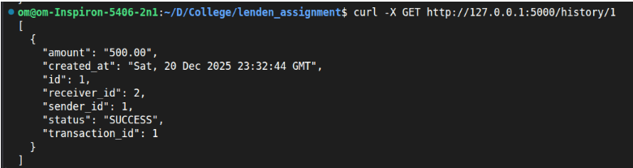

# Real-time Transaction & Audit Log System

## Project Overview

This project is an implementation of **Assignment 2: Real-time Transaction & Audit Log System**.  
It simulates a simple **peer-to-peer (P2P) fund transfer system** with a **mandatory, immutable audit trail** and **real-time updates**.

### Key Objectives Addressed
- Atomic fund transfers using database transactions
- Immutable audit logging of all successful transfers
- Real-time balance and transaction history updates on the frontend
- Clean separation of backend (Flask + MySQL) and frontend (React + TypeScript)

### Implementation Approach
- **Backend**: Python Flask REST APIs with MySQL for persistence.
- **Atomicity**: MySQL transactions ensure debit and credit either both succeed or both fail.
- **Audit Trail**: A dedicated `audit_log` table stores immutable transaction records.
- **Real-time Updates**: Socket.IO is used to push balance and transaction updates instantly to clients.
- **Frontend**: React + TypeScript with a clean UI showing balance, transfer form, and transaction history.

---
- ###### PS: also tried to use Docker but it takes time to put everything in a container and run with sockets. Also did not focus much on the frontend, it is very simple, focused more on real time sockets to fetch balance and history and focused on the database.


---

## Application Screenshots

### Login


### Fund Transfer Interface



---

## Real-time Updates (GIF)

### Live Balance & History Update


## Tech Stack

### Backend
- Python 3.10+
- Flask
- Flask-CORS
- Flask-SocketIO
- MySQL
- mysql-connector-python

### Frontend
- Node.js (v18+ recommended)
- React
- TypeScript
- Vite
- Socket.IO Client
- Tailwind CSS

---

## Setup & Run Instructions

### 1. Backend Setup

#### Prerequisites
- Python 3.10 or higher
- MySQL Server running locally

#### Database Setup
Create a database and tables using the following SQL: (just run ./backend/init.db)

```sql
CREATE DATABASE wallet_app;
USE wallet_app;

CREATE TABLE users (
    id INT PRIMARY KEY AUTO_INCREMENT,
    name VARCHAR(100),
    balance DECIMAL(15,2) NOT NULL DEFAULT 0.00
);

CREATE TABLE transactions (
    id BIGINT PRIMARY KEY AUTO_INCREMENT,
    sender_id INT NOT NULL,
    receiver_id INT NOT NULL,
    amount DECIMAL(15,2) NOT NULL,
    created_at TIMESTAMP DEFAULT CURRENT_TIMESTAMP
);

CREATE TABLE audit_log (
    id BIGINT PRIMARY KEY AUTO_INCREMENT,
    transaction_id BIGINT NOT NULL,
    sender_id INT NOT NULL,
    receiver_id INT NOT NULL,
    amount DECIMAL(15,2) NOT NULL,
    status VARCHAR(20),
    created_at TIMESTAMP DEFAULT CURRENT_TIMESTAMP
);
```

Insert sample users:
```sql
INSERT INTO users (name, balance) VALUES
('Alice', 10000),
('Bob', 5000),
('Charlie', 3000);
```

#### Backend Installation
```bash
cd backend
pip install -r requirements.txt
```

#### Run Backend
```bash
python app.py
```

Backend runs on:
```
http://localhost:5000
```

---

### 2. Frontend Setup

#### Prerequisites
- Node.js (v18+)
- npm

#### Installation
```bash
cd frontend
npm install
```

#### Run Frontend
```bash
npm run dev
```

Frontend runs on:
```
http://localhost:5173
```

---

## API Documentation

### POST /transfer
Transfers funds between users (atomic operation).

**Request Body**

```json
curl -X POST http://localhost:5000/transfer -H "Content-Type: application/json" -d '{"sender_id": 1, "receiver_id": 2, "amount": 500}'
```

**Response**


---

### GET /balance/<user_id>
Fetches the current balance of a user.
```json
curl -X GET http://localhost:5000/balance/1
```
**Response**



---

### GET /history/<user_id>
Fetches audit log (transaction history) for a user.
```json
curl -X GET http://localhost:5000/history/1
```
**Response**



---

## Real-time Events (Socket.IO)

### Events Emitted
- `balance_update`
- `new_transaction`

These events update the user interface instantly after a successful transfer.

---

## Database Schema

### users
| Column | Type | Description |
|------|------|------------|
| id | INT | User ID |
| name | VARCHAR | User name |
| balance | DECIMAL | Current balance |

### transactions
| Column | Type | Description |
|------|------|------------|
| id | BIGINT | Transaction ID |
| sender_id | INT | Sender |
| receiver_id | INT | Receiver |
| amount | DECIMAL | Amount transferred |
| created_at | TIMESTAMP | Time of transaction |

### audit_log
| Column | Type | Description |
|------|------|------------|
| id | BIGINT | Audit ID |
| transaction_id | BIGINT | Related transaction |
| sender_id | INT | Sender |
| receiver_id | INT | Receiver |
| amount | DECIMAL | Amount |
| status | VARCHAR | SUCCESS |
| created_at | TIMESTAMP | Log timestamp |

---

## Notes
- Only successful transactions are logged in the audit table.
- The audit log is immutable and append-only.

---

## AI usage log
First built the backend with database and flask endpoints. Then after testing them with curl, moved to a simple react+typescript frontend.

- Database init.sql created with GPT 5.1 : 
  - Score - 5
  - very effective, for creating a database and inserting values in table for quick testing
- Backend routes/transfer.py and routes/audit.py created with GPT 5.1:
  - score - 4
  - Pros - quick code writing, instant api testing and hardly any intervention
  - cons - Alot of times gives deprecated code, so deprecation warnings pop up and something don't work like sockets or eventlet, so have to start from scratch or change certain things like requirements.txt to rollback to older versions.
- Frontend App.tsx:
  - score - 2
  - Pros - Good for initial boilerplate frontend code to get components. Fast and quick to test endpoints from frontend
  - Cons - Still an issue of deprecated code and node versions, needs manual intervention to enhance UI, like component colors, position, font, etc
- Docker:
  - score - 1
  - Gave a lot of deprecated code (docker-compose commands) and eventlet functionalities to keep web sockets running in container
  - will make better dockerfiles and compose files myself.
---
## Author
**Om Sable**  
Final Year B.Tech (Computer Engineering)
